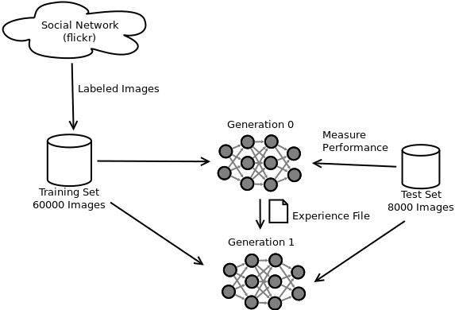

# Social Neural Networks

## Introduction
### Goal
In this work we want to check, if it is possible to *train convolutional neural networks (CNN)*
with images tagged by social networks users. Therefore this work is called *social neural networks (SNN)*.
For example, to let a network learn how cats and dogs look like, we download images that are tagged with 'cat' 
and images that are tagged with 'dog' from social networks and use those images to train a CNN. To check the 
performance of the network a *well defined* dataset is used in this work. 
With well defined dataset we mean, that we can be sure that all images are correctly labeled (because lots of images from social 
networks contains invalid tags). We used the ImageNet dataset to check the performance of the network.

### Motivation
In supervised learning a CNN is trained with labeled images. This means, that training examples
are feed forward through the network to generate a prediction using the current weights of the network. Afterwards an error between the
predictions and the labels is calculated. The error is used to adjust all learnable parameters of the network into the negative 
direction of the gradient estimate. This reduces the error on the training set and produces a more
desirable output in the next iteration. [Goodfellow et al. (2016)](#Goodfellow-et-al-2016) states that about 5.000 labeled examples per category
are needed to get an acceptable performance of the network. 

It is a timeconsuming task to create a dataset with at least 5.000 labeled images per class. So in this work we want to check if it
is possible to train a CNN with images from 6 different classes (0=cat, 1=dog, 2=hamburger, 3=sushi, 4=beach, 5=rock) that are tagged 
by flickr users to save lots of time.

### Challenge
The challenge of this work is, that lots of examples are are invalid tagged. For example if the network should learn 
the difference between beer and wine, we download images with those tags from social networks. Sometimes images
of austrian guys are tagged with beer. Its funny but its not helpful for our network to learn, how a beer or a wine looks like.

## System
The following image shows an overview of all different parts of the system:

### Social Network
ToDo: Describe datr

### Training Set
ToDo: Describe and cite datr

* Split training set into training and validation set using 3-fold cross validation
* Data augmentation
* Balance training set using oversampling
* Use f1 to measure performance, because of imbalanced validation set

### Test Set
ToDo: Describe why we used imagenet 

### Network Architecture
ToDo: Describe why we not used a pre-trained inception model

### Multiple generations
ToDo: Describe the idea of multiple generations

## Results 

## Future works

## References
<a name="Goodfellow-et-al-2016">[1]</a>: Ian Goodfellow and Yoshua Bengio and Aaron Courville. *Deep Learning*, 
URL <a href="http://www.deeplearningbook.org">http://www.deeplearningbook.org</a>, 2016